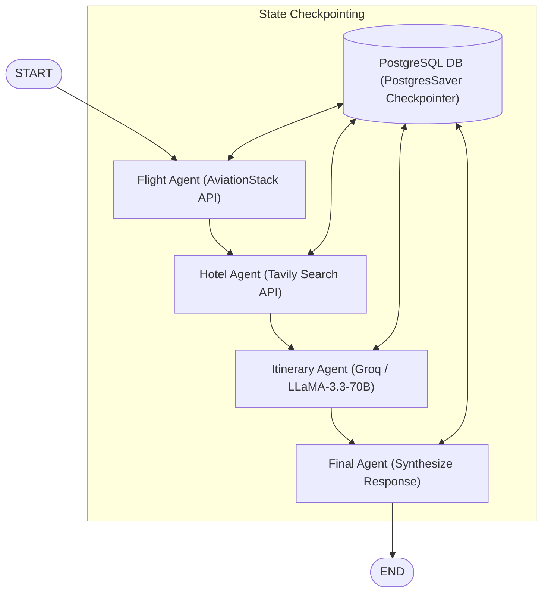

# ✈️ Multi-Agent AI Travel Booking System with Long-Term Memory

A state-of-the-art, interactive multi-agent travel planner built using **LangGraph**, **Groq (LLaMA 3.3 70B)**, **Streamlit**, and **PostgreSQL**. The system utilizes specialized AI agents working in a coordinated pipeline to search for flights, retrieve curated hotel options, draft a detailed day-by-day itinerary, and compile a polished travel plan—all backed by persistent thread-based memory.

---

## 🏗️ System Architecture

The application is modeled as a state machine using **LangGraph**. A centralized, persistent PostgreSQL database tracks state checkpoints, enabling thread-safe conversation tracking and long-term memory across user sessions.



### The Agent Pipeline

1. **✈️ Flight Agent**: Connects to the **AviationStack API** to pull actual airline schedules, status updates, and travel routings.
2. **🏨 Hotel Agent**: Leverages the **Tavily Search API** to scour the web for top-rated accommodations, hotels, and tourist guides tailored to the user's budget and target destination.
3. **🗓️ Itinerary Agent**: Utilizes **LLaMA 3.3 70B via Groq** to compose a comprehensive, highly optimized day-by-day travel schedule, incorporating the flight and hotel results.
4. **🧠 Final Agent**: Synthesizes the aggregated data, processes anomalies (e.g. flight layout adjustments), and shapes the output into a premium, professional travel proposal.

---

## ✨ Key Features

*   **Coordinated Multi-Agent Orchestration**: Powered by LangGraph, routing state values sequentially and logging granular run parameters.
*   **Long-Term Thread Memory**: Remembers past user preferences and search settings using a `PostgresSaver` checkpointer, allowing conversations to seamlessly span multiple queries.
*   **Immersive Streamlit Frontend**:
    *   Sleek dark-mode aesthetic with custom Inter typography and smooth micro-animations.
    *   Real-time status updates showing which agent is currently executing and what information it has retrieved.
    *   Automated plan generation with downloadable Markdown exports.
    *   Persistent auto-saving of generated proposals under the `travel_plans/` directory.
*   **Rich Integrations**: Combines high-quality real-time API integrations with local database connections.

---

## 📁 Project Structure

```text
├── tools/
│   ├── flight_tool.py         # AviationStack API wrapper
│   └── tavily_tool.py         # Tavily Search API wrapper
├── travel_plans/              # Auto-saved Markdown travel plans (Local storage)
├── .env                       # Environment configurations (API Keys & DATABASE_URL)
├── .gitignore                 # Excluded files and folders
├── frontend.py                # Premium Streamlit UI application
├── main.py                    # LangGraph core definitions & CLI interface
├── pyproject.toml             # Project package declarations
└── requirements.txt           # Declared dependencies
```

---

## 🚀 Setup & Installation

### 1. Prerequisites
Ensure you have **Python 3.10+** installed. We recommend using **`uv`** (a fast Python package installer and resolver) or standard `pip`.

### 2. Clone and Install Dependencies
Navigate to your project folder and run:
```bash
# Using uv (Recommended)
uv pip install -r requirements.txt

# Or using standard pip
pip install -r requirements.txt
```

### 3. Environment Variables
Create a `.env` file in the root directory (or use the pre-configured one) and supply the necessary credentials:
```ini
# AviationStack API Key for flight details
AVIATIONSTACK_API_KEY=your_aviationstack_api_key

# Groq API Key for the LLaMA 3.3 70B LLM
GROQ_API_KEY=your_groq_api_key

# Tavily API Key for search operations
TAVILY_API_KEY=your_tavily_api_key

# PostgreSQL Connection String (Neon DB, local Postgres, or cloud instance)
DATABASE_URL=postgresql://<user>:<password>@<host>:<port>/<dbname>?sslmode=require
```

---

## 🎮 How to Use

You can run the travel booking system in two ways: via the interactive graphical dashboard or directly in your terminal.

### Option A: The Streamlit Web UI (Recommended)
The Streamlit frontend provides a responsive dashboard showcasing the live agent pipeline, destination highlights, interactive parameters, and full markdown output exports.

To launch the dashboard, run:
```bash
# Using uv
uv run streamlit run frontend.py

# Or using standard streamlit
streamlit run frontend.py
```
Open the provided local URL (usually `http://localhost:8501`) in your browser to interact with the application.

### Option B: Terminal / CLI Interface
For testing and lightweight command-line usage, you can run the console client:
```bash
# Using uv
uv run main.py

# Or using standard python
python main.py
```
You will be prompted to enter your travel request (e.g. `Plan a 7-day trip to Japan`), and the agent logs will output directly in your shell.

---

## 🔒 Memory & Checkpointing
The system keeps track of the travel history using the `thread_id` setting:
*   In the **Streamlit Frontend**, you can view or modify your active session ID in the sidebar under **User ID** (defaults to `aarohi_user`).
*   In the **CLI**, the script is configured to use `user_aarohi` as the default thread ID.
*   By specifying the same `thread_id` across multiple runs, LangGraph will load the state history from your PostgreSQL database automatically, maintaining context for subsequent recommendations!
